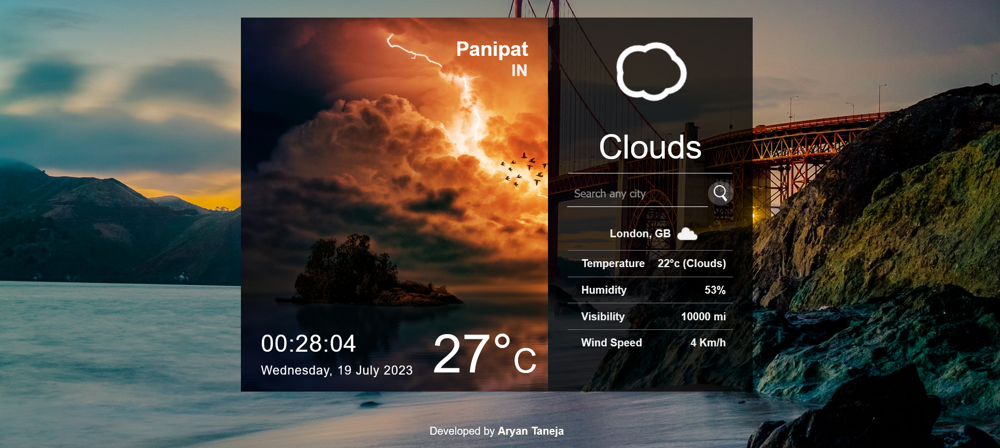
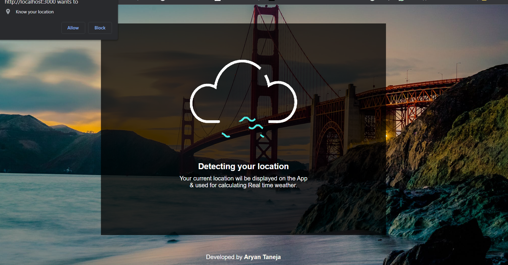

# React Weather Search App

This is a simple weather search application built with React. It allows users to search for the current weather conditions of a specific location.

## Features

- Search for weather conditions of any location
- Display current temperature, humidity, wind speed, and weather description
- Responsive design for desktop and mobile devices

## Demo

You can check out the live demo of the app [here](https://legendary-pika-12dd71.netlify.app/).

## Screenshots

## Installation

1. Clone the repository: git clone https://github.com/tanejaaryan99/Weather-app.git

2. Navigate to the project directory: cd weather-app

3. Install the dependencies: npm install

4. Start the development server: npm start

5. Open your browser and visit `http://localhost:3000` to see the app running.

## API Key

This app uses the [OpenWeather API](https://openweathermap.org/api) to fetch weather data. You need to obtain an API key from OpenWeather and add it to the 'src/apiKeys.js file: replace {Your key} with your api key

## Contributing

Contributions are welcome! If you find any issues or have suggestions, please open an issue or submit a pull request.

## Author 

This app is created by Aryan Taneja

